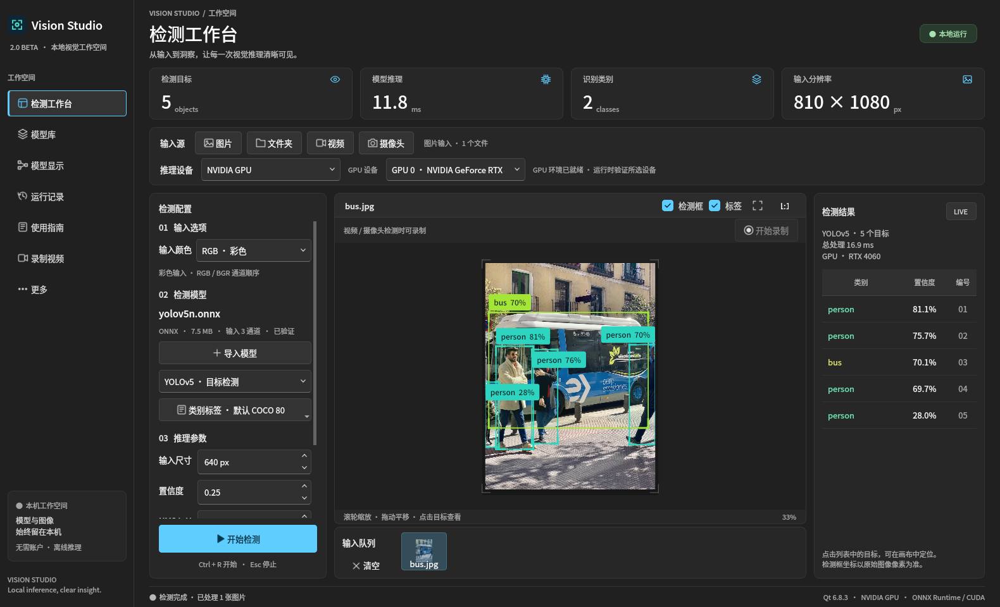
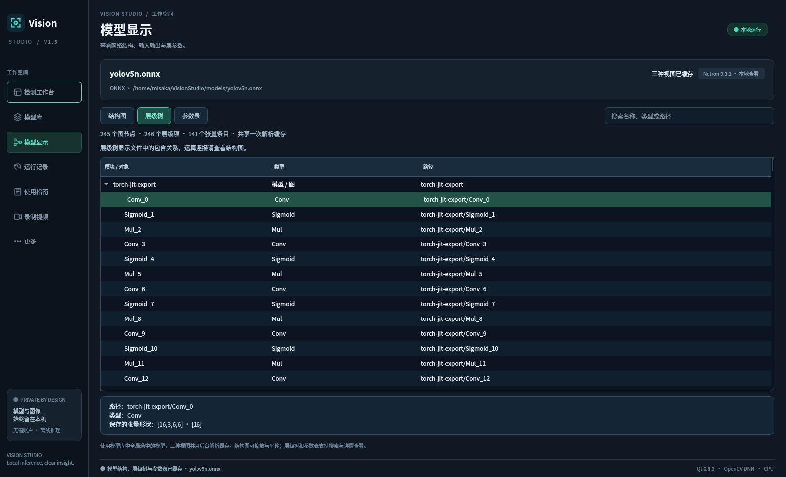
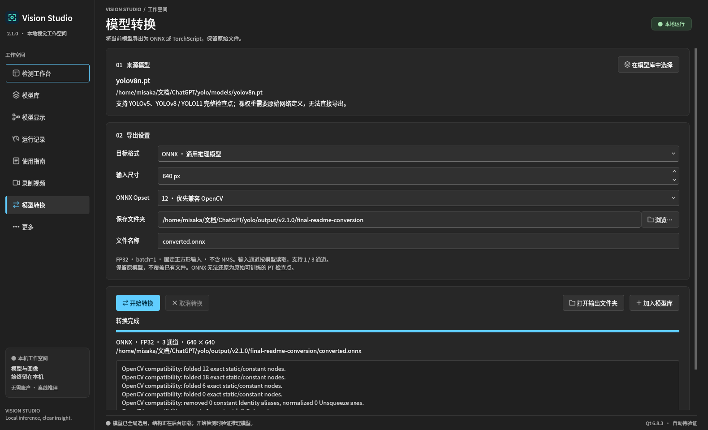

# Vision Studio

**基于 C++17 / Qt 6.8 的本地 YOLO 推理、模型可视化与转换工具。** 支持 ONNX / PT 模型、图片与视频检测、摄像头输入、灰度与左右目处理、标注视频录制，以及结构图、层级树和参数表。

[下载发行版](https://github.com/misaka-ning/vision-studio/releases) · [更新日志](CHANGELOG.md) · [使用指南](docs/使用指南.md) · [报告问题](https://github.com/misaka-ning/vision-studio/issues)

当前版本：**2.1.0**，新增模型库右键管理与 PT → ONNX / TorchScript 转换。界面保留 [Fluent-Qt](https://github.com/calvinhxx/Fluent-Qt) 风格。CPU／NVIDIA GPU、ONNX／PT、灰度和左右目处理沿用现有约定。发行平台：**Ubuntu 22.04 LTS amd64**。应用代码采用 **AGPL-3.0-only**。



## 功能

- **检测工作台**：图片队列、批量图片、视频和摄像头输入，YOLO 检测与单标签图像分类，置信度和 NMS IoU 阈值可调；输入尺寸、置信度和 NMS IoU 不受鼠标滚轮误改，文件夹结果保存放在后台，停止时不受保存队列阻塞。批量完成后可点击队列图片回看本轮标注、目标列表和指标，并导出所选图片的结果。
- **模型库**：导入 ONNX / PT / TorchScript，可拖动排序并在重启后保留；右键打开模型位置、编辑备注、更改显示名称或从列表移除。显示名称与备注持久保存，重命名不改原始文件名与内容，移除保留文件；全局选用统一决定工作台、模型显示与转换页默认来源。
- **模型显示**：Netron 结构图、可展开层级树、参数表；后台预加载并缓存，切换页面与模式复用解析结果，树与表支持搜索和详情。
- **灰度与双目输入**：灰度按模型的 1 / 3 通道适配；单设备水平左右拼接视频或摄像头可只处理左目或右目。预览和导出显示实际所选画面与颜色模式。
- **标注与录制**：检测框、类别、置信度、缩放和平移；保存 PNG / JSON / CSV，自动保存选项下方可直接打开结果目录。视频和摄像头可开始／结束录制，在「录制视频」页浏览、播放和导出。
- **模型转换**：新页面位于「录制视频」之后、「更多」之前，将受支持的 PT 转换为 ONNX 或 TorchScript，提供后台进度、日志、取消、打开输出目录与完成后加入模型库。导出 CPU FP32、batch=1、固定正方形输入、不含 NMS，保留 C1 / C3；ONNX 可选 Opset 12 / 17，已有文件拒绝覆盖。
- **运行记录与更多**：保留处理记录、模型和耗时；「更多」集中提供运行示例与手动导出。
- **计算设备**：工作台可选自动、CPU 或 NVIDIA GPU；「更多」检查并准备独立 GPU 环境。自动模式在 GPU 不可用时显示原因并使用 CPU，显式 GPU 失败时报告错误；结果记录实际设备。



普通 PT 的层级树表示文件可解析的模块包含关系，裸权重按名称分组；参数表列出权重、常量和缓冲，不能直接作为可训练参数总量。ONNX 更适合查看完整运算连接。不支持或损坏的模型会显示文字说明。详细范围见 [模型说明](docs/模型说明.md)。



## 下载与安装

从 [GitHub Releases](https://github.com/misaka-ning/vision-studio/releases) 选择已发布版本，以下命令用于 2.1.0 正式发布后安装。每版只上传 **3 个手动附件**：安装包 `.deb`、`vision-studio-X.Y.Z-complete-source.tar.xz`、`SHA256SUMS`。

页面另外显示 GitHub 自动提供的 **Source code (zip)** 和 **Source code (tar.gz)** 两个源码入口，它们由平台生成，不能从 Release 中移除。下载三个手动附件后，先校验，再安装：

```bash
sha256sum -c SHA256SUMS
sudo apt install ./vision-studio_2.1.0-1_amd64.deb
vision-studio
```

2.1.0 正式包的 Debian 版本为 `2.1.0-1`，高于 `2.0.0-1` 及此前 Beta，可用以上 APT 命令直接升级。先结束检测、录像与模型转换，导出需要永久保存的结果，退出旧程序再安装；升级保留个人设置、模型、运行记录、导出、录像与已准备的 GPU 环境。本轮临时回看缓存不会跨程序重启保留。

也可从应用菜单启动 **Vision Studio**。首次体验可打开「更多 → 运行示例」，再导入自己的模型。

程序安装到 `/opt/VisionStudio`，设置、运行记录、导出和录像位于 `${XDG_DATA_HOME:-$HOME/.local/share}/vision-studio`。转换模型默认位于该目录的 `converted-models/`，也可指定其他可写文件夹。普通用户无需向安装目录写入文件。`VISION_STUDIO_DATA_DIR` 可指定另一数据目录。卸载应用使用 `sudo apt remove vision-studio`，个人数据由用户保留或自行清理。

正式 DEB 包含 Qt 6.8.3 / WebEngine、独立 CPU PyTorch 环境、Netron 9.3.1 与本地示例模型，模型准备完成后可以离线使用；APT 可能需要安装包声明的系统共享库。Git checkout 与便携打包脚本生成的目录需要自行准备 runtime，不能直接当作完整 DEB 安装环境。

V1.6 的 NVIDIA GPU 支持首次需在「更多」点击「准备 GPU 支持」，从官方源下载约 4–5 GB 锁定依赖，建议预留至少 20 GB 空间。配置写入个人数据目录的 `gpu-runtime/`，可以取消；只有实际 CUDA 自检成功才发布环境，失败保留原来的 CPU／GPU 环境。不安装或修改显卡驱动，不在 APT／DPKG 安装过程中下载 CUDA。GPU 准备完成后模型推理可离线执行。

## 推理架构与兼容范围

| 用途 | 实现 | 当前设备 |
| --- | --- | --- |
| 界面、输入、结果显示、录制与导出 | C++17 / Qt 6.8.3 | 本机 |
| ONNX CPU 推理 | C++ / OpenCV DNN 4.5.4 | CPU |
| ONNX GPU 推理 | C++ / ONNX Runtime 1.23.2 CUDA Execution Provider | NVIDIA GPU，可选环境 |
| PT 推理 | 常驻本地 Python / PyTorch 2.9.1 / Ultralytics 8.4.173 | CPU；可选 CUDA 12.8 |
| 模型结构显示 | Qt WebEngine / Netron 9.3.1，本机回环服务 | 本机 |
| PT → ONNX / TorchScript 转换 | 后台 Python / PyTorch；ONNX 1.17.0 / protobuf 6.33.0 | CPU，独立于工作台推理设备 |

V1.6 增加 NVIDIA CUDA 后端，TensorRT、AMD 与 Intel GPU 尚未提供。GPU 环境固定为 Python 3.10／3.11、PyTorch `2.9.1+cu128`、Torchvision `0.24.1+cu128`、CUDA 12.8、cuDNN 9.10.2 与 ONNX Runtime 1.23.2；推荐 Linux NVIDIA 驱动 ≥ 570.26。`nvidia-smi` 的 CUDA Version 表示驱动支持上限，不代表已安装 CUDA Toolkit。应用使用官方运行库 wheel，无需全局 Toolkit。[PyTorch 版本](https://pytorch.org/get-started/previous-versions/)、[ORT CUDA 兼容](https://onnxruntime.ai/docs/execution-providers/CUDA-ExecutionProvider.html)、[CUDA 12.8 驱动要求](https://docs.nvidia.com/cuda/archive/12.8.0/cuda-toolkit-release-notes/index.html)。

模型可视化不参与检测推理，结构查看不会执行 `torch.load`；PT 推理加载检查点可能执行其 Python 代码，请使用自己训练或可信来源的模型。

ONNX 支持符合本项目输入输出约定的 YOLOv5、YOLOv8 / YOLO11 原始检测输出与单标签分类；CPU 与 GPU 的模型算子分别以 OpenCV DNN、ONNX Runtime CUDA 支持范围为准。图像输入需为 NCHW，固定 1 或 3 通道；灰度直接输入 C1 或复制到 C3，彩色要求 C3。带内置 NMS、多输入、分割、姿态、旋转框和量化专用预处理不在当前兼容范围。

PT 支持兼容的 Ultralytics YOLOv8 / YOLO11 完整检查点、随附 YOLOv5 v7.0 框架可加载的旧版完整检查点，以及带必要任务、类别和通道元数据的标准 TorchScript。裸 `state_dict` 可显示静态信息，但还需要网络架构才能推理。具体预处理、灰度、左右目和输出约定请阅读 [模型说明](docs/模型说明.md) 和 [使用指南](docs/使用指南.md)。

模型转换支持现代 Ultralytics 检测／分类、兼容 YOLOv5 检测及带任务、类别和通道信息的标准 TorchScript。保留任务、类别与输入通道元数据；TorchScript 归档包含 `config.txt`。通过转换页加入库时记录结果配置，选用时应用任务、类别、尺寸与默认归一化，手工标签优先；C1 自动选择灰度，C3 仍需按训练预处理选择颜色模式。本次转换来源在开始时固定，完成后须明确入库才改变全局模型。

转换器针对旧版 OpenCV 的部分静态形状与广播限制做等价规约，输出仍为标准 ONNX，保存前检查图并比较 Python OpenCV CPU 输出。系统 C++ OpenCV、真实图片及 GPU 后端仍需分别验证。裸权重或未知自定义网络需要原始定义，本版不提供 ONNX → PT 图转换或原始训练检查点还原；固定输入跟踪不保留任意动态控制流或训练功能。取消时保留源文件与已有输出；若完整结果已在取消请求前写出，界面提示完成或保留，详见 [转换步骤](docs/使用指南.md#转换模型)。

## 从源码构建

依赖 CMake ≥ 3.21、C++17 编译器、Ninja、Qt 6.8.3 SDK，以及 OpenCV Core / Imgproc / Imgcodecs / Videoio / DNN。Qt 模块为 Core、Gui、Widgets、Svg、Network、WebChannel、WebEngineWidgets，测试还需要 Test；WebEngine 需要配套的 Quick / Qml / Positioning 模块及资源。

```bash
git clone https://github.com/misaka-ning/vision-studio.git
cd vision-studio

# Python 3.10 或 3.11，需要 venv；首次准备会下载依赖
./scripts/setup_pt.sh

# QT_PREFIX 可按本机 SDK 位置修改
QT_PREFIX="$HOME/Qt/6.8.3/gcc_64" ./scripts/build.sh
./build/bin/vision-studio
```

示例模型和测试资源保留在仓库中。`scripts/build.sh` 完成 CMake 配置、构建与 CTest。也可直接使用 CMake：

```bash
cmake -S . -B build -G Ninja -DCMAKE_BUILD_TYPE=Release \
  -DCMAKE_PREFIX_PATH="$HOME/Qt/6.8.3/gcc_64" -DBUILD_TESTING=ON
cmake --build build --parallel 4
ctest --test-dir build --output-on-failure
```

源码开发的 PT / Netron 依赖由 `requirements-pt.txt` 和 `requirements-pt.lock.txt` 约束；正式 DEB 使用的 headless OpenCV runtime 另有 [发行依赖锁](docs/release/requirements-release.lock.txt)。`VISION_STUDIO_BASE_PYTHON` 可指定建立 runtime 的 Python，`VISION_STUDIO_PYTHON` 可指定运行时解释器的绝对路径。

GPU 依赖使用独立的 `requirements-gpu.txt`／`requirements-gpu.lock.txt`；完整锁包含版本与官方 wheel 的 SHA256，按 `--no-deps --require-hashes` 安装，避免 Ultralytics 额外装入 GUI OpenCV。源码开发也可执行：

```bash
./scripts/setup_gpu.sh
/usr/bin/python3.10 scripts/gpu_probe.py
```

默认解释器明确使用 `/usr/bin/python3.10`，不跟随 PATH 中的 Conda。可用 `--base-python /绝对路径/python3.11`、`--runtime-dir /用户专用目录/gpu-runtime` 指定配置位置，并用 `VISION_STUDIO_GPU_RUNTIME_DIR` 在应用中选择同一目录。Netron 继续使用独立 CPU 环境。

## 验证与发行

2.1.0 的开发验收有效结果为 **13 套通过、0 失败、0 跳过**，由完整基线、UI 复验及转换修复后的受影响测试复验汇总，未描述为一次整套通过。UI 为 38 项通过；最终 C++ 转换推理 14 项通过、62.674 秒，Python 转换 20 项通过、56.295 秒，包含 18 次真实导出。完整记录与各轮原始日志见 [ctest-qa.json](docs/releases/evidence/2.1.0/ctest-qa.json)。

转换补齐旧版 OpenCV 常量左侧减法的标准 ONNX 等价规约，TorchScript 检测缓存随设备移动并保持严格 FP32。完整 YOLOv8n 与 YOLOv5n 固定 640 输入的 ONNX CPU／CUDA 检测结果按容差对照原 PT，TorchScript 原始输出与 CUDA 缓存迁移核验均通过。范围与限制见 [ONNX 完整模型对照](docs/releases/evidence/2.1.0/conversion-portability-proof/portability-onnx-full-model-qa.json) 和 [TorchScript 原始输出对照](docs/releases/evidence/2.1.0/conversion-portability-proof/portability-torchscript-raw-qa.json)。

发行前必须完成最终 DEB 普通用户只读运行与转换、APT 模拟、隔离安装／卸载、CPU／CUDA 推理及源码归档核验；报告绑定最终文件，未通过不发布。实际范围及原始日志保存到 `docs/releases/evidence/2.1.0/`，并列入 [2.1.0 发布说明](docs/releases/2.1.0.md)，开发验收不能替代安装包验收。

最终对应源码另有独立 `source-bundle-qa.json` 随标签保存，未通过不发布；报告与冻结清单在归档后加入仓库，避免递归自校验。新增转换依赖、原始源码与通知一同交付。

历史记录保留在 [2.0.0](docs/releases/2.0.0.md)、[Beta.2](docs/releases/2.0.0-beta.2.md)、[Beta.1](docs/releases/2.0.0-beta.1.md) 和 [1.6.0](docs/releases/1.6.0.md) 及各自证据目录，不改写原报告与发行文件。工作台与结构图沿用 V2.0 视觉基线；模型转换截图来自本版真实导出及 CPU 推理，来源记录见 [conversion-preview.json](docs/releases/evidence/2.1.0/conversion-preview.json)。

```bash
./build/bin/vision-studio --smoke /tmp/vision-studio-onnx-smoke
./build/bin/vision-studio --smoke-pt /tmp/vision-studio-pt-smoke
./build/bin/vision-studio --smoke-model /tmp/vision-studio-model-smoke
./build/bin/vision-studio --smoke-model /tmp/vision-studio-pt-model-smoke \
  --display-model "$PWD/models/yolov8n.pt"
```

模型显示自检生成结构图、层级树、参数表截图及含内容数量、模式和缓存复用状态的报告。无显示器时可以使用 `QT_QPA_PLATFORM=offscreen`；正常桌面启动保留 WebEngine sandbox。

打包、对应源码及上游重建说明见 [打包说明](packaging/README.md) 和 [对应源码与重建](docs/release/对应源码与重建.md)。完整源码包内已有应用源码拆分归档、`SOURCE-SHA256SUMS`、`SOURCE-INVENTORY.json` 及上游源码、许可和原始通知，可解压后获取。GitHub 自动生成的 Source code ZIP／tar.gz 来自 Git 标签，不能替代 Release 中的完整对应源码包。

源码主线为 `main`，正式标签为 `vX.Y.Z`，预发布标签为 `vX.Y.Z-beta.N`。每个新版必须按 [版本管理](docs/版本管理.md) 完成测试、源码与标签推送，并使用 `scripts/github_release.py` 发布和校验 Release；远端核验后本地保留最新两个正式版的发行与独立构建副本；2.1.0 发布并核验后为 2.1.0 与 2.0.0，本地 1.6.0 副本逐版核验后清理。旧 Beta 副本逐版精确核验后单独清理，历史版本可通过标签和 Release 获取，原归档保持不变。

## 文档、贡献与许可

- [使用指南](docs/使用指南.md)、[模型说明](docs/模型说明.md)、[UI 设计](docs/UI设计.md)
- [更新日志](CHANGELOG.md)、[参与贡献](CONTRIBUTING.md)、[版本管理](docs/版本管理.md)
- [第三方许可清单](docs/release/第三方许可清单.md)、[对应源码与重建](docs/release/对应源码与重建.md)

欢迎提交 [Issue](https://github.com/misaka-ning/vision-studio/issues) 或 Pull Request。维护者：**misaka_ning <1468549029@qq.com>**。

新编写的应用代码按 **AGPL-3.0-only** 发布，完整正文见 [LICENSE](LICENSE)。Qt、Ultralytics、YOLOv5、Netron、示例模型和其他组件保留各自许可；通知与正文位于 `packaging/licenses/`。转发发行版时请继续提供对应源码、原始通知与校验文件。
